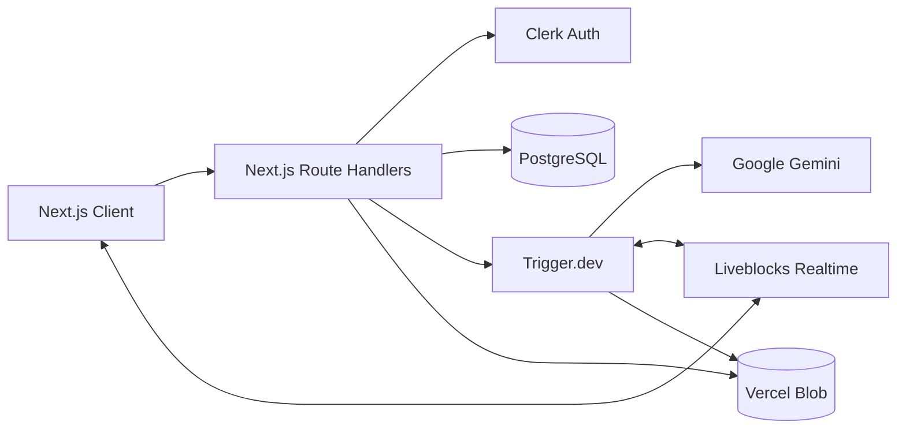

# system_architecture_board

<div align="center">
  <p><strong>Collaborative system design, accelerated by AI.</strong></p>
  <p>Describe an architecture, refine it with your team on a live canvas, and generate a durable technical specification.</p>

  <p>
    
    
    
    
  </p>
</div>

## Overview

system_architecture_board is a full-stack system design workspace for turning product requirements into collaborative architecture diagrams and implementation-ready technical specifications.

Users can create a project, prompt an AI architect in natural language, and watch it apply structured changes to a shared canvas. Team members can edit the same graph in real time, discuss decisions in project chat, and generate persistent Markdown specifications from the final design.

The application is designed around explicit service boundaries: synchronous APIs handle authentication and orchestration, durable workers perform AI generation, Liveblocks owns real-time collaboration, PostgreSQL stores relational metadata, and Vercel Blob stores generated artifacts.

## Capabilities

- **AI-assisted architecture**: Gemini converts natural-language requirements into validated node and edge operations.
- **Multiplayer editing**: Nodes, edges, cursors, presence, and project chat synchronize across connected clients.
- **Visual modeling**: Create, connect, move, resize, recolor, relabel, and remove architecture elements.
- **Starter templates**: Import microservices, CI/CD, and event-driven reference architectures.
- **Technical spec generation**: Produce Markdown specifications from the current graph and conversation history.
- **Persistent project state**: Store canvas snapshots and generated specifications independently from relational metadata.
- **Project access control**: Support project ownership, collaborator invitations, and protected room access.
- **Live task status**: Surface AI workflow progress and completion state in the editor.
- **Saved specifications**: Preview and download previously generated project specifications.

## System Architecture



### Request and Data Flow

1. Clerk authenticates the request and provides the current user identity.
2. Route handlers validate input and verify project ownership or collaborator access.
3. Short-lived CRUD operations execute directly against PostgreSQL through Prisma.
4. AI workloads are dispatched to Trigger.dev rather than running inside HTTP requests.
5. Design workers publish structured graph mutations to the active Liveblocks room.
6. Spec workers generate Markdown, upload it to Vercel Blob, and persist its metadata in PostgreSQL.
7. Clients subscribe to room state and task status for real-time updates.

### Storage Model

| Data | System of record |
| --- | --- |
| Projects, collaborators, task runs, spec metadata | PostgreSQL via Prisma |
| Collaborative graph and presence | Liveblocks |
| Canvas snapshots | Vercel Blob |
| Generated Markdown specifications | Vercel Blob |

This separation keeps relational queries efficient while avoiding large generated payloads in the database.

## Technology

| Layer | Technology | Responsibility |
| --- | --- | --- |
| Application | Next.js 16, React 19, TypeScript | UI, server rendering, and API routes |
| Interface | Tailwind CSS 4, shadcn/ui, Base UI | Accessible components and design tokens |
| Canvas | React Flow | Interactive graph editing |
| Collaboration | Liveblocks | Shared state, presence, events, and chat |
| Authentication | Clerk | Identity, sessions, and route protection |
| AI | Google Gemini, AI SDK | Structured design and spec generation |
| Workflows | Trigger.dev | Durable execution, retries, and run status |
| Database | PostgreSQL, Prisma ORM | Relational metadata and access relationships |
| Artifacts | Vercel Blob | Canvas snapshots and generated documents |

## Engineering Decisions

- **Durable AI execution**: Model calls run in background workers so request timeouts do not interrupt long-running generation.
- **Authorization at mutation boundaries**: API routes and token endpoints verify project membership before exposing or changing data.
- **Typed graph operations**: AI output is constrained to structured canvas actions rather than applying free-form client mutations.
- **Separated persistence layers**: PostgreSQL stores searchable metadata; blob storage holds large generated artifacts.
- **Server-first rendering**: Client components are limited to browser interaction and real-time state boundaries.
- **Shared schema contracts**: Imported templates, user-created elements, and AI-generated elements use the same node and edge types.

## Repository Structure

```text
app/
  api/                  Authenticated project, AI, Liveblocks, and spec routes
  editor/               Project home and collaborative workspace pages
components/
  editor/               Canvas, navigation, project, sharing, and AI surfaces
  ui/                   Reusable UI primitives
context/                Product, architecture, UI, and workflow documentation
hooks/                  Project actions, autosave, sharing, and shortcuts
lib/                    Data access, authorization, Prisma, and Liveblocks clients
prisma/                 Schema modules and migrations
trigger/                Durable AI design and specification workflows
types/                  Shared canvas and task contracts
```

## Local Development

### Prerequisites

- Node.js 20 or later
- npm
- PostgreSQL database
- Clerk application
- Liveblocks project
- Trigger.dev project
- Google AI API key
- Vercel Blob store

### Install

```bash
git clone <repository-url>
cd system_architecture_board
npm install
```

### Configure

Create `.env.local` in the project root:

```env
# Authentication
NEXT_PUBLIC_CLERK_PUBLISHABLE_KEY=
CLERK_SECRET_KEY=
NEXT_PUBLIC_CLERK_SIGN_IN_URL=/sign-in
NEXT_PUBLIC_CLERK_SIGN_UP_URL=/sign-up

# Persistence and collaboration
DATABASE_URL=
LIVEBLOCKS_SECRET_KEY=
BLOB_READ_WRITE_TOKEN=

# Background workflows
TRIGGER_PROJECT_REF=
TRIGGER_SECRET_KEY=

# AI
GOOGLE_AI_API_KEY=
```

### Initialize the Database

```bash
npx prisma generate
npx prisma migrate deploy
```

### Run the Application

Start the web application:

```bash
npm run dev
```

Start the local Trigger.dev worker in a second terminal:

```bash
npx trigger.dev@latest dev
```

Open [http://localhost:3000](http://localhost:3000).

## Commands

| Command | Purpose |
| --- | --- |
| `npm run dev` | Start the Next.js development server |
| `npm run build` | Create a production build |
| `npm run start` | Run the production server |
| `npm run lint` | Run static analysis with ESLint |
| `npx prisma generate` | Regenerate the Prisma client |
| `npx prisma migrate dev` | Create and apply a local migration |
| `npx prisma migrate deploy` | Apply committed migrations |
| `npx prisma studio` | Inspect relational data locally |

## Security Model

- Protected routes require a valid Clerk session.
- Project mutations require owner access unless collaborator access is explicitly supported.
- Liveblocks room tokens are issued only after server-side membership validation.
- Trigger.dev public tokens are scoped to a verified task run and requesting user.
- Specification preview and download routes verify both project access and artifact ownership.
- Secrets remain server-side and are supplied through environment variables.

## Product Workflow

1. Sign in and create a project.
2. Open the shared architecture workspace.
3. Import a starter design or describe a system to the AI architect.
4. Review and refine the generated graph with collaborators.
5. Generate a technical specification from the graph and project discussion.
6. Preview or download the persisted Markdown document.
